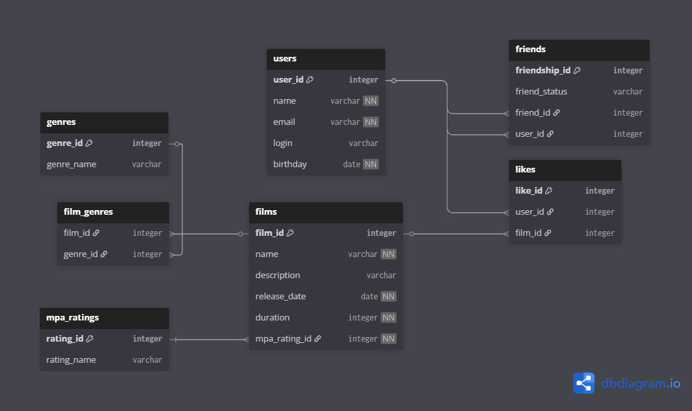

# java-filmorate
Репозиторий приложения filmorate

## ER-диаграмма


## Описание базы-данных
### Основные сущности и их назначение
- **users** — данные пользователей (id, имя, email, логин, дата рождения и т.п.).
- **films** — информация о фильмах (id, название, описание, дата выхода, продолжительность, ссылка на рейтинг MPA).
- **genres** — справочник жанров.
- **film_genres** — связь M:N между фильмами и жанрами (film_id, genre_id).
- **mpa_ratings** — справочник рейтингов (G, PG, PG-13 и т.д.).
- **likes** — записи о том, что пользователь лайкнул фильм; реализована как M:N
- **friends / friendships** — таблица дружбы между пользователями с полем статуса

## Примеры запросов
- Вывести количество лайков
```sql
SELECT COUNT(*) AS likes_count
FROM likes;
```

- Получить список всех пользователей
```sql
SELECT user_id, name, email, login, birthday
FROM users
ORDER BY user_id;
```

- Подсчитать количество лайков у фильма
```sql
SELECT f.name, COUNT(l.user_id) AS likes_count
FROM films f
LEFT JOIN likes l ON f.film_id = l.film_id
WHERE f.film_id = 3
GROUP BY f.name;
```

- Получить список друзей пользователя
```sql
SELECT u.user_id, u.name, u.email
FROM friends f
JOIN users u ON u.user_id = f.friend_id
WHERE f.user_id = 1
AND f.friend_status = 'ACCEPTED';
```

- Найти фильмы определённого жанра (например, "Комедия")
```sql
SELECT f.name, f.release_date
FROM films f
JOIN film_genres fg ON f.film_id = fg.film_id
JOIN genres g ON fg.genre_id = g.genre_id
WHERE g.genre_name = 'Комедия'
ORDER BY f.release_date DESC;
```
